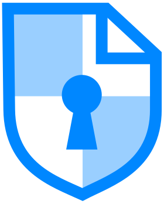

<p align="center">
  
</p>

# CryptPad on StartOS

> Everything not listed in this document should behave the same as upstream
> CryptPad. If a feature, setting, or behavior is not mentioned here, the
> upstream documentation is accurate and fully applicable — see the
> Documentation section of `instructions.md` for links.

[CryptPad](https://github.com/cryptpad/cryptpad) is a privacy-first, end-to-end encrypted collaboration suite — documents, spreadsheets, presentations, whiteboards, kanban boards and more, all encrypted in the browser before touching the server. The package that wraps it is unusual in one respect: CryptPad needs **two origins** to keep its document sandbox isolated, so almost everything below follows from that.

- **Upstream repo:** <https://github.com/cryptpad/cryptpad>
- **Wrapper repo:** <https://github.com/Start9-Community/cryptpad-startos>

---

## Table of Contents

- [Image and Container Runtime](#image-and-container-runtime)
- [Volume and Data Layout](#volume-and-data-layout)
- [File Models](#file-models)
- [Dependencies](#dependencies)
- [Network Access and Interfaces](#network-access-and-interfaces)
- [Installation and First-Run Flow](#installation-and-first-run-flow)
- [Actions](#actions)
- [Tasks](#tasks)
- [Health Checks](#health-checks)
- [Backups and Restore](#backups-and-restore)
- [Limitations and Differences](#limitations-and-differences)
- [Quick Reference for AI Consumers](#quick-reference-for-ai-consumers)

---

## Image and Container Runtime

One image, built here from a Dockerfile that adds a single layer to upstream's, and one subcontainer.

| Property     | Value                                                      |
| ------------ | ---------------------------------------------------------- |
| Image source | Local Dockerfile, `FROM` the upstream `cryptpad/cryptpad`  |
| Architecture | x86_64, aarch64                                            |
| Runtime user | `cryptpad` (UID/GID 4001)                                  |
| Entrypoint   | Upstream's, steered by the `CPAD_CONF` environment variable |

| Subcontainer  | Purpose                                            |
| ------------- | -------------------------------------------------- |
| `cryptpad-sub` | The `primary` daemon — the one to `attach` to |

The added layer runs `install-onlyoffice.sh`, baking the Document / Sheet / Presentation editors into the image so they are available the moment the service starts. Upstream fetches them on first use instead, which costs the user a ten-to-fifteen minute wait the first time they open an office document.

The container runs upstream's entrypoint with `CPAD_CONF` pointed at a config file this package has already written. The entrypoint only generates a config when that path is missing, so the file existing is what keeps configuration StartOS-managed end to end.

There is **no in-container reverse proxy**, and adding one would be a regression. CryptPad's Node server emits the CSP/COEP/CORP headers its own `/checkup/` self-test asserts on; a second set from an nginx or Caddy in front of it breaks those checks, and StartOS terminates TLS at the platform layer, so there is nothing for such a proxy to do.

## Volume and Data Layout

One volume, mounted at three points because two of CryptPad's state directories live outside its data root.

| Volume | Mount Point              | Purpose                                              |
| ------ | ------------------------ | ---------------------------------------------------- |
| `main` | `/data`                  | All persistent CryptPad data, plus this package's own state |
| `main` (subpath `customize`)      | `/cryptpad/customize`      | The StartOS-written `application_config.js` |
| `main` (subpath `onlyoffice-conf`) | `/cryptpad/onlyoffice-conf` | OnlyOffice's per-version install state       |

Under the volume root:

| Path                                     | Contents                                                                    |
| ---------------------------------------- | --------------------------------------------------------------------------- |
| `store.json`                             | This package's state (see [File Models](#file-models))                      |
| `datastore/`                             | Document data                                                               |
| `blob/`, `blobstage/`                    | Encrypted file uploads                                                      |
| `block/`                                 | Authenticated user blocks                                                   |
| `pins/`                                  | User-pinned document references                                             |
| `archive/`                               | Archived data                                                               |
| `tasks/`                                 | CryptPad's scheduled-task storage                                           |
| `decrees/decree.ndjson`                  | CryptPad's server-side decree log                                           |
| `logs/`                                  | Activity logs                                                               |
| `customize/application_config.js`        | Holds `loginSalt` — written once on first install and never regenerated     |

The daemon runs as UID/GID 4001 while the service runtime runs as root, so `main.ts` pre-creates every one of those directories and `chown`s them before the container starts. A directory that CryptPad cannot write is the usual cause of a daemon that starts and then does nothing.

`/cryptpad/www/common/onlyoffice/dist/` — the per-version OnlyOffice assets — is deliberately **not** a mount. It lives in the image rootfs and is refreshed when the image is rebuilt; mounting an empty volume over it would shadow the content the Dockerfile baked in.

## File Models

One model, plus one read-only view of a file CryptPad owns. The service's own `config.js` is not modelled at all — it is generated from scratch on every start.

| File                    | Format | Modelled                  | Written by                    |
| ----------------------- | ------ | ------------------------- | ----------------------------- |
| `store.json`            | JSON   | `FileHelper.json`         | Init and the actions          |
| `decrees/decree.ndjson` | NDJSON | `FileHelper.string`, read-only | CryptPad                 |

`store.json` holds `mainUrl` and `sandboxUrl` (both `null` until the user picks them), `adminKeys` (the list the **Add Administrator by Public Key** action manages), and `wizardCompletedNotified` (a one-shot latch so the setup-complete notification fires once per install rather than on every container rebuild). It is seeded on every init kind by an empty `merge`, which applies each field's default without disturbing a value already there. A hand edit survives until an action rewrites the same key.

`decree.ndjson` is CryptPad's own append-only log and is **never written from here**. It is modelled only so the read is reactive: the setup-token prompt depends on a line the daemon writes after it first boots, and a plain `readFile` would not re-trigger the init watcher when that file appears.

`config.js` is regenerated into the container's ephemeral rootfs on every start from `store.json` plus upstream's documented defaults. It is not on the volume, and a hand edit does not survive a restart — by design, since the origins it carries have to track what the user selected. Everything it does *not* set is upstream's default or is managed from CryptPad's own `/admin/` panel:

| Setting                                                        | Owned by                        |
| -------------------------------------------------------------- | ------------------------------- |
| Main URL (`httpUnsafeOrigin`), Sandbox URL (`httpSafeOrigin`)  | **Set Main / Sandbox URL** actions |
| Administrator keys (`adminKeys`)                               | **Add Administrator by Public Key** action |
| Storage paths, ports, log destination                          | This package, fixed             |
| `loginSalt`                                                    | This package, written once at install |
| Instance name and branding, registration policy, upload limits, enabled applications, 2FA policy, directory listing | CryptPad's `/admin/` panel |

## Dependencies

None.

## Network Access and Interfaces

Two interfaces, both bound to the same container port, because the browser — not the server — is what enforces CryptPad's sandbox boundary.

| Interface | Id        | Type | Port | Description                                    |
| --------- | --------- | ---- | ---- | ---------------------------------------------- |
| Web UI    | `ui`      | ui   | 3000 | The application, `/admin/`, and `/checkup/`    |
| Sandbox Origin | `sandbox` | api  | 3000 | The origin the document iframe loads from |

CryptPad requires `httpUnsafeOrigin ≠ httpSafeOrigin`: the sandbox iframe has to come from a different **origin** so same-origin policy isolates it from the application around it. Each MultiHost gets its own hostname and port from StartOS while both target port 3000 in the container, and CryptPad serves the same content regardless of `Host` — its CSP differentiation is by URL path, not by host. So two bindings on one port is the whole mechanism.

The sandbox interface is typed `api` rather than `ui` for one concrete effect: the service page's launch control filters on `type === 'ui'`, so the sandbox never appears as an **Open** button. It does not hide the interface — the Interfaces tab lists and links every interface regardless of type. Its hostname is chosen through the **Set Sandbox URL** action, which is the only mechanism the user has for it.

WebSocket traffic needs no interface of its own. CryptPad's HTTP server intercepts upgrade requests for `/cryptpad_websocket` and proxies them internally to its own WebSocket server on port 3003, so the browser connects to `wss://<main-host>/cryptpad_websocket` over the ordinary interface. Port 3003 is never bound externally.

## Installation and First-Run Flow

Setup is a three-step chain, and the first two block the daemon. Nothing starts until the user has chosen both origins.

An origin is scheme + host + port, so **two ports on one hostname already satisfy CryptPad's requirement** — which is what StartOS produces on a LAN with no extra setup, since the two MultiHosts get different external ports. Two distinct hostnames matter only when serving over a domain, and for a different reason: upstream warns that restrictive networks filter traffic on unusual ports.

1. **Set Main URL** and **Set Sandbox URL** can be completed in either order. Both write to `store.json`; the daemon-start gate is the pair of `critical` tasks described under [Tasks](#tasks), with a matching throw in `main.ts` as a backstop.
2. Clearing the two tasks unblocks the service but **does not start it** — the user has to press Start. The daemon then bootstraps and writes an install token into its decree log.
3. **Complete CryptPad Initial Setup** then appears as an `important` task carrying a single-use URL. Opening it runs CryptPad's own wizard: first administrator account, instance name and branding, application selection, registration policy.

When the wizard finishes, the init watcher posts a one-shot **"CryptPad setup complete"** notification — useful as a confirmation if the user walked away mid-wizard. It is latched on `wizardCompletedNotified` so it cannot repeat.

After that, day-to-day administration happens in CryptPad's `/admin/` panel rather than in StartOS.

## Actions

Four user-facing actions and one hidden one. Two of them exist because CryptPad pins itself to a single origin and StartOS cannot guess which.

### Set Main URL

**When to run it:** at install, and any time the address users should reach CryptPad on changes. **What it changes:** `store.json`'s `mainUrl`, which becomes `httpUnsafeOrigin` in the regenerated `config.js`. **Cost:** the daemon restarts. **Repeat safety:** idempotent; re-running with the same value is a no-op.

It refuses a URL whose origin matches the current sandbox URL, and `main.ts` repeats that check before starting — a matching pair would collapse the sandbox boundary rather than fail loudly. **What happens next:** the daemon restarts on the new origin; already-open browser tabs keep working until they are reloaded.

### Set Sandbox URL

The same shape as Set Main URL, bound to the `sandbox` interface and `store.json`'s `sandboxUrl`. **When to run it:** at install, and after anything that reassigns ports — notably a restore. **This is the only way to pick the sandbox origin**, because the sandbox interface is not launchable from the service page.

### Complete CryptPad Initial Setup

**Hidden — not user-facing as an action.** It is surfaced by the `setup-token-pending` task and should be reached that way; a support agent should never send a user to the actions list for it.

**What it returns:** a `/install/#<token>` URL, masked and copyable, with no QR. The token is a credential — whoever holds it creates the first administrator on an instance that has none — so it follows the fleet's masked-and-copyable convention for secrets, and the QR is dropped because rendering the same value as a scannable image would defeat masking the text.

**Cost:** none; it reads the decree log off the volume, so it answers whether or not the service is running. **Repeat safety:** safe to re-run — before the daemon has bootstrapped it says so and asks for another thirty seconds; after the wizard has completed it reports that and points at `/admin/`.

### Add Administrator by Public Key

**When to run it:** to recover administrator access when the install-token URL was missed, or to add and remove administrators without going through the running application. The day-to-day path is CryptPad's own `/admin/#support` panel.

**What it changes:** `store.json`'s `adminKeys`, which becomes the `adminKeys` array in `config.js`. **Cost:** the daemon restarts. **Repeat safety:** the submitted list is the complete new state, not a delta — anything not in it is revoked on the next restart. There is no separate remove action.

**Outputs:** the saved list, one copyable row per key, so an accepted key can be told from a rejected one.

Three things about it generate support traffic:

**The two administrator lists.** CryptPad keeps administrators in two independent places, and this action reaches one of them.

| Admin created by                 | Stored in                              | Appears in this action | Removable from `/admin/` |
| -------------------------------- | -------------------------------------- | ---------------------- | ------------------------ |
| Setup wizard, or promoted in-app | The decree log                         | **No**                 | Yes                      |
| This action                      | `config.js`, from `store.json`         | Yes                    | **No**                   |

Upstream labels the second group in `/admin/` as *"Admin added into config.js. Can only be removed by editing the config file."* Here the config file is generated, so the equivalent of editing it is re-running this action with the row deleted. The practical consequence — **on a fresh install this list is empty even though a working administrator already exists** — is correct behavior and not a missing migration.

**Adding a key that is already a decree-log admin shadows it.** `lib/env.js` seeds `Env.admins` / `Env.adminsData` from `config.adminKeys` before decrees replay, and `ADD_ADMIN_KEY` returns early for a key already in `Env.admins` — so it never reaches `adminsData`, and the only surviving row is the `config.js` one, which by definition renders without a Remove button. Nothing is destroyed and it is reversible: delete the key here, submit, and after the restart the decree replays normally and the key is removable again.

**Validation is syntactic, and that is the ceiling rather than a shortcut.** A key is exactly 44 characters (43 base64 characters plus `=`), with `-` accepted as the escaped form of `/` and no `_` in the alphabet, mirroring upstream's `Keys.canonicalize`. What it cannot do is confirm an account with that key exists — upstream cannot either. CryptPad is end-to-end encrypted and the server holds opaque login blocks rather than a queryable roster, so granting admin means "whoever holds the private half of this key", not "this registered user". A correctly-shaped typo is accepted and becomes an entry nobody can use.

Length is the part worth guarding: a malformed key is filtered out of `Env.admins` by `lib/env.js` but kept verbatim in `Env.adminsData`, which is what `/admin/` renders — so it grants nothing while leaving a junk row that the panel offers no way to remove.

### Run Diagnostics

**When to run it:** to verify an install, or as the first step on any "CryptPad looks broken" report. **What it returns:** the URL of CryptPad's built-in `/checkup/` self-test, prefixed with the configured main URL so the tests run against the right origin. **What it changes:** nothing. **Cost:** none.

A correctly configured instance reports **51 of 55**, and the four failures are expected:

| Test | Reports                             | Why                                                                             | Fixable                  |
| ---- | ----------------------------------- | ------------------------------------------------------------------------------- | ------------------------ |
| 14   | Encrypted support tickets not enabled | Optional feature, off by default                                              | Yes — `/admin/` → Support |
| 34   | No terms of service                 | Optional instance content                                                       | Yes — `/admin/`          |
| 36   | No privacy policy                   | Optional instance content                                                       | Yes — `/admin/`          |
| 54   | HSTS not required                   | StartOS terminates TLS at the platform edge; CryptPad's server sees plain HTTP | **No**                   |

The checkup also flags `/customize/application_config.js` as a customized asset. That is expected and load-bearing — it is where `loginSalt` lives.

## Tasks

Three tasks, and the first two are the daemon-start gate. This is the section to read when a user reports that CryptPad will not start and the ordinary controls have disappeared.

| Task (`replayId`)                                     | Severity    | Raised when                                                  | Cleared when                                          |
| ----------------------------------------------------- | ----------- | ------------------------------------------------------------ | ----------------------------------------------------- |
| `main-url-not-set` / `main-url-unavailable`           | `critical`  | No main URL saved, or the saved one is no longer a live address | A currently-resolvable main URL is saved            |
| `sandbox-url-not-set` / `sandbox-url-unavailable`     | `critical`  | The same, for the sandbox URL                                 | The same                                              |
| `setup-token-pending`                                 | `important` | Both URLs set, and the decree log has an install token but no admin key yet | Any `ADD_ADMIN_KEY` decree appears |

All three are maintained by a reactive watcher that re-runs whenever the store, the live address list, or the decree log changes; they can therefore return on their own. The `-unavailable` variants are the ones that fire after a restore, since a restored package is assigned new ports and the saved URLs stop resolving.

The setup task is deliberately `important` rather than `critical`. Once both URLs are set the daemon *can* run, so blocking startup on a follow-up reminder would be wrong — and an earlier revision that made it `critical` produced an unrecoverable deadlock, where the task blocked the service and the action to clear it could not be run while the service was stopped.

Setup completion is detected by the presence of an `ADD_ADMIN_KEY` decree, not by the token's removal: CryptPad never emits a paired `RM_INSTALL_TOKEN`, so the token line stays in the log forever and scanning for its removal would leave the task pending indefinitely.

## Health Checks

One check, on the only daemon. It probes the same endpoint CryptPad's own client fetches at boot.

| Check     | Displayed       | Method                              | Grace  |
| --------- | --------------- | ----------------------------------- | ------ |
| `primary` | "Web Interface" | HTTP GET `localhost:3000/api/config` | 60s   |

A 200 means the Node server is up, the config parsed, and the API is answering — stronger than a port-listening check, since the port can be open before the application is serving. A failure that persists past the grace period means the config did not parse or the daemon died; the service log will say which.

The grace period is generous because upstream's entrypoint runs `npm run build` on **every** container start, regenerating a few dozen HTML files before `node server.js`. Several seconds pass with the port closed, and a tighter window would flash a red failure on every ordinary restart. Expect a handful of `ECONNREFUSED` lines from the health check itself during that window — they come from `checkWebUrl` and cannot be suppressed from the package; the grace period governs the reported status, not the logging.

This is the only check on purpose. An earlier revision had four more (`admin`, `checkup`, `sandbox-security`, `onlyoffice`); once `/api/config` returns 200 they all turn green together and add no diagnostic value. **Run Diagnostics** is the deeper probe.

## Backups and Restore

The whole `main` volume is copied wholesale — `sdk.Backups.ofVolumes('main')`. Nothing is excluded, and nothing is dumped-and-replayed, so what comes back is the files as they were.

That covers every pad and upload, the decree log, `store.json`, OnlyOffice's install state, and `customize/application_config.js` — which is the one that matters most, because it holds `loginSalt`. Restore replays init with `kind === 'install'`, and the file-existence guard in `init/writeLoginSalt.ts` is what stops a fresh salt being minted over the restored one; regenerating it would invalidate every existing user's password with no recovery path.

**Changing the main URL does not invalidate logins**, and neither does a restore. `Cred.deriveFromPassphrase` salts scrypt with the username plus `AppConfig.loginSalt`; the origin is not an input. There is a misleading failure mode worth recognising, though: `customSalt()` falls back to `''` when `loginSalt` is not a string, so a page that has not fully initialised for this instance derives different keys from correct credentials and the user is told **"invalid username or password"** rather than anything about origins.

A restored instance has one thing left to do: **re-pick both URLs.** New ports are assigned on restore, so the saved values no longer resolve, and the watcher raises `main-url-unavailable` / `sandbox-url-unavailable`. Documents, accounts, administrators and branding are all already back — only the addresses change.

Expect the restore itself to take **tens of minutes** even for a near-empty instance, against a backup that finishes in seconds. This is not the OnlyOffice bake: a fresh install of the identical `.s9pk` completes in under a minute, so the cost is in the restore path rather than in unpacking the image. Nothing in this package can shorten it.

## Limitations and Differences

1. **Two origins are mandatory.** CryptPad will not start with one, and the two must differ in hostname or port. On a LAN this is automatic; over a domain it means provisioning a second hostname.
2. **An untrusted Root CA breaks CryptPad specifically, and looks like a broken package.** StartOS issues certificates for `.local`, IP and `.onion` addresses from the server's own Root CA. For a single-origin service the user clicks through the warning once; that escape hatch exists only for top-level navigation, and CryptPad loads its sandbox in an iframe, for which browsers offer no certificate exception at all. The symptom is distinctive: the address bar shows the *main* origin while the error names the *sandbox* origin on a different port, with no dismiss option. Nothing in the package can fix it — the second origin is mandated by CryptPad and certificate trust is a client-side decision. User-facing mitigations are in `instructions.md`.
3. **The launch button may open an address CryptPad rejects.** StartOS binds an interface to every enabled gateway address and the launcher picks one by heuristic (`InterfaceService.launchableAddress`: public domain → WAN IPv4 → private domain → mDNS, biased by how the admin is currently reaching StartOS). CryptPad accepts exactly one origin and answers every other with *"This page can only be accessed via …"*, usually stalling at *Loading…* rather than redirecting. The launcher has no knowledge of the saved main URL and no way to acquire any — interfaces carry no notion of a primary address. Established sessions are unaffected until reloaded; the rejection is a page-load check, not a per-request one.
4. **`loginSalt` is set once and never changed.** Changing it would invalidate every existing user's password hash, so the package writes it at first install and the init guard prevents regeneration. A restore preserves it.
5. **The `adminKeys` list is one of CryptPad's two administrator lists** and cannot remove administrators from the other. See [Actions](#actions).
6. **HSTS cannot be set.** StartOS terminates TLS at the platform edge and emits no `Strict-Transport-Security`; the container only ever sees plain HTTP. `/checkup/` test 54 reports this on every StartOS install and no package-side change can resolve it. It does not affect functionality.
7. **No email integration.** CryptPad ships no SMTP support in any current release — account flows are end-to-end encrypted and local, and the support help-desk uses CryptPad's own in-app messaging. There is no SMTP action because nothing on the CryptPad side would consume the credentials.
8. **x86_64 and aarch64 only.** The upstream image publishes no riscv64.
9. **Single-node only.** Clustered CryptPad deployments are not supported.
10. **This is not an upgrade path from the StartOS 0.3.x CryptPad package.** That package is a different layout — six volumes under `/cryptpad/` — wrapping a CryptPad release from several years earlier, and nothing maps across. `canMigrateFrom` is derived from the version graph and cannot be narrowed, so StartOS will regard this as a valid upgrade and run this package's `up` migration, which is empty. Anyone coming from it should export their drive from the old instance first and re-import after installing this one. Nobody has run that path on a real migrated server, so treat it as unsupported rather than assuming a particular failure mode.
11. **Some log lines are normal and should not be investigated.** `HTTP_404` on OnlyOffice assets (`plugins.json`, `themes.json`, `document_editor_service_worker.js`, an icon or two) while an editor loads — the bundle probes for optional files CryptPad's trimmed distribution does not ship, and upstream's own flagship instance 404s on the same paths. `Error while fetching URL … ECONNREFUSED` during the first seconds of a start, from the health check. `HK_GET_OLDER_HISTORY` with an all-zeros channel id, which upstream logs at `ERROR` and is benign.

---

## Quick Reference for AI Consumers

```yaml
package_id: cryptpad
image: built from ./Dockerfile, FROM cryptpad/cryptpad
architectures:
  - x86_64
  - aarch64
subcontainers:
  - cryptpad-sub # the only container
volumes:
  main: /data # also subpath-mounted at /cryptpad/customize and /cryptpad/onlyoffice-conf
file_models:
  - store.json # mainUrl, sandboxUrl, adminKeys, wizardCompletedNotified
  - decrees/decree.ndjson # read-only; written by CryptPad
startos_managed_env_vars:
  - CPAD_CONF # points at the pre-written config.js
  - CPAD_MAIN_DOMAIN
  - CPAD_SANDBOX_DOMAIN
dependencies: []
interfaces:
  ui: { type: ui, port: 3000 }
  sandbox: { type: api, port: 3000 } # same container port, different origin
actions:
  - set-main-url
  - set-sandbox-url
  - show-setup-token-url # hidden; surfaced by the setup-token-pending task
  - add-admin-key
  - run-diagnostics
tasks:
  - { action: set-main-url, severity: critical }
  - { action: set-sandbox-url, severity: critical }
  - { action: show-setup-token-url, severity: important }
health_checks:
  - primary # displayed "Web Interface"
```
